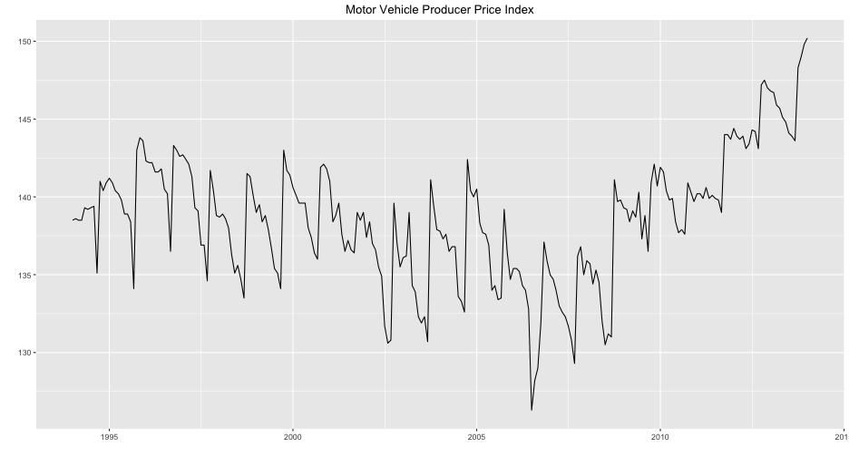
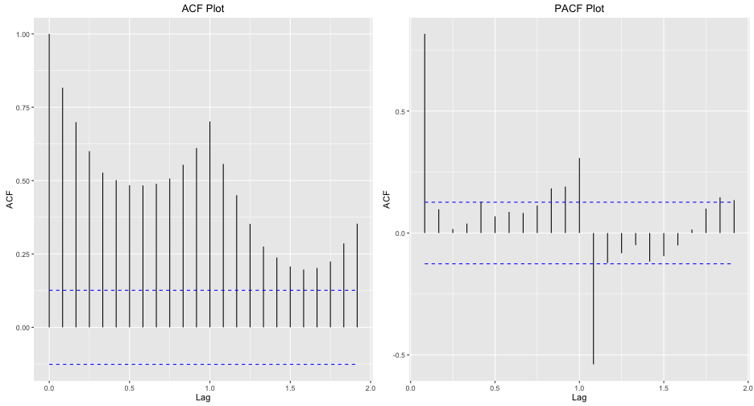
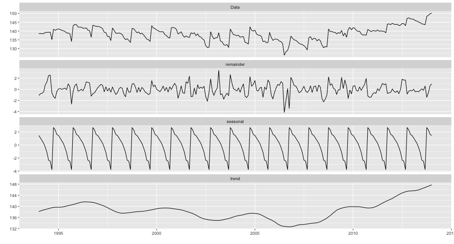
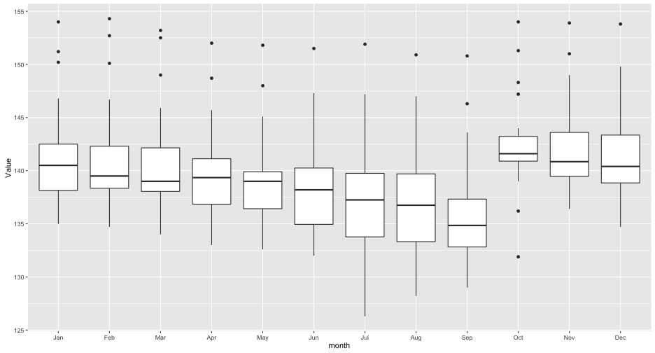
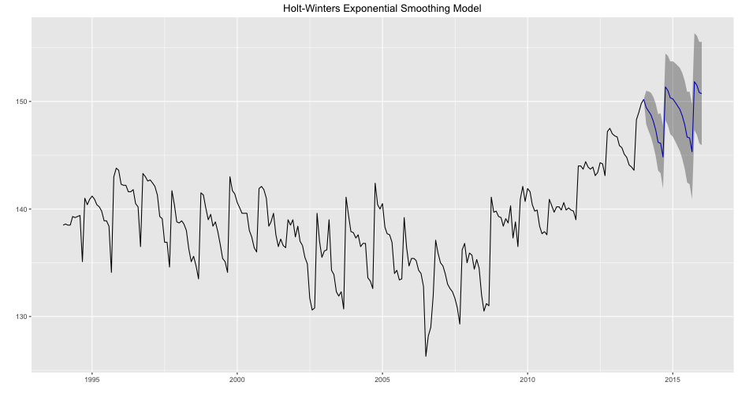
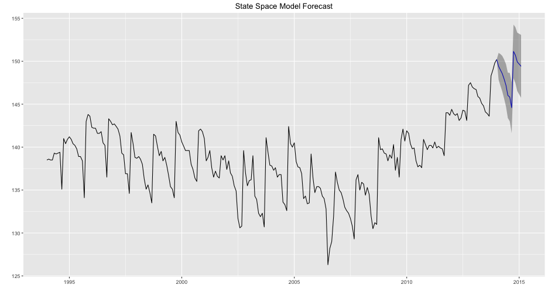
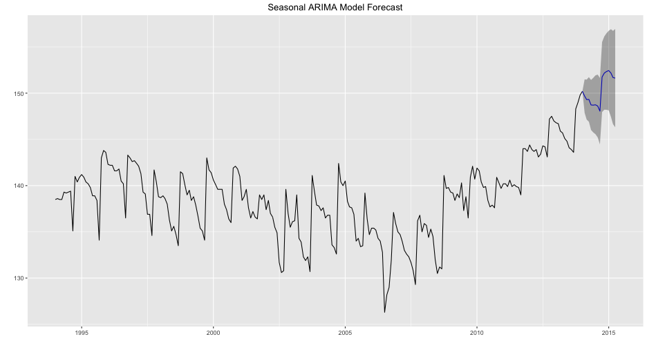

## Producer Price Indexes 

"A measurement of the average change over time in the selling 
prices received by domestic producers for their output."

-Bureau of Labor Statistics

--- .class #id 

## The Series

---

## ACF and PACF of the Series

---

## Series Decomposition

---

## A Closer Look at Seasonality

---

## Holt-Winter's Exponential Smoothing Model

---

## State Space Model

---

## Seasonal Arima Model

--- 

## Model Evaluations

<!-- html table generated in R 3.2.3 by xtable 1.8-2 package -->
<!-- Tue Apr 19 00:09:48 2016 -->
<table border=1>
<caption align="bottom"> Holt-Winter's Model Accuracy Measures </caption>
<tr> <th>  </th> <th> ME </th> <th> RMSE </th> <th> MAE </th> <th> MPE </th> <th> MAPE </th> <th> MASE </th> <th> ACF1 </th> <th> Theil's U </th> <th> R-squared </th>  </tr>
  <tr> <td align="right"> Training set </td> <td align="right"> 0.00 </td> <td align="right"> 1.21 </td> <td align="right"> 0.85 </td> <td align="right"> -0.01 </td> <td align="right"> 0.62 </td> <td align="right"> 0.41 </td> <td align="right"> 0.06 </td> <td align="right">  </td> <td align="right"> 0.91 </td> </tr>
  <tr> <td align="right"> Test set </td> <td align="right"> 3.23 </td> <td align="right"> 3.44 </td> <td align="right"> 3.23 </td> <td align="right"> 2.12 </td> <td align="right"> 2.12 </td> <td align="right"> 1.57 </td> <td align="right"> 0.30 </td> <td align="right"> 3.27 </td> <td align="right"> -6.28 </td> </tr>
   </table>

<!-- html table generated in R 3.2.3 by xtable 1.8-2 package -->
<!-- Tue Apr 19 00:09:48 2016 -->
<table border=1>
<caption align="bottom"> State Space Model Accuracy Measures </caption>
<tr> <th>  </th> <th> ME </th> <th> RMSE </th> <th> MAE </th> <th> MPE </th> <th> MAPE </th> <th> MASE </th> <th> ACF1 </th> <th> Theil's U </th> <th> R-squared </th>  </tr>
  <tr> <td align="right"> Training set </td> <td align="right"> 0.06 </td> <td align="right"> 1.22 </td> <td align="right"> 0.87 </td> <td align="right"> 0.04 </td> <td align="right"> 0.63 </td> <td align="right"> 0.42 </td> <td align="right"> 0.06 </td> <td align="right">  </td> <td align="right"> 0.91 </td> </tr>
  <tr> <td align="right"> Test set </td> <td align="right"> 2.41 </td> <td align="right"> 2.57 </td> <td align="right"> 2.41 </td> <td align="right"> 1.58 </td> <td align="right"> 1.58 </td> <td align="right"> 1.17 </td> <td align="right"> -0.50 </td> <td align="right"> 2.20 </td> <td align="right"> 0.37 </td> </tr>
   </table>

<!-- html table generated in R 3.2.3 by xtable 1.8-2 package -->
<!-- Tue Apr 19 00:09:11 2016 -->
<table border=1>
<caption align="bottom"> Seasonal Arima Model Accuracy Measures </caption>
<tr> <th>  </th> <th> ME </th> <th> RMSE </th> <th> MAE </th> <th> MPE </th> <th> MAPE </th> <th> MASE </th> <th> ACF1 </th> <th> Theil's U </th> <th> R-squared </th>  </tr>
  <tr> <td align="right"> Training set </td> <td align="right"> 0.03 </td> <td align="right"> 1.41 </td> <td align="right"> 0.96 </td> <td align="right"> 0.01 </td> <td align="right"> 0.70 </td> <td align="right"> 0.47 </td> <td align="right"> -0.01 </td> <td align="right">  </td> <td align="right"> 1.00 </td> </tr>
  <tr> <td align="right"> Test set </td> <td align="right"> 0.12 </td> <td align="right"> 0.81 </td> <td align="right"> 0.74 </td> <td align="right"> 0.08 </td> <td align="right"> 0.49 </td> <td align="right"> 0.36 </td> <td align="right"> -0.04 </td> <td align="right"> 0.65 </td> <td align="right"> 0.88 </td> </tr>
   </table>

---
